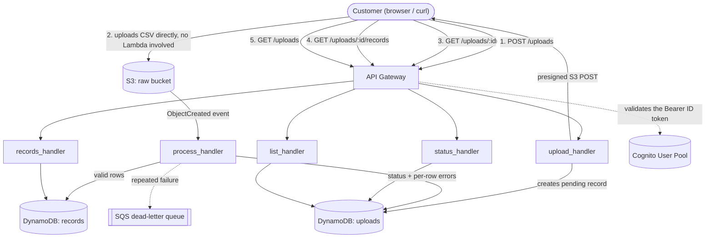
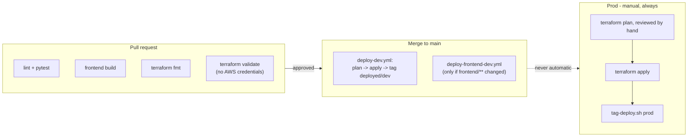

# csvUploader

[](https://github.com/alfa04/csvUploader/actions/workflows/ci.yml)

A cloud service for ingesting, validating, storing, and retrieving drug discovery data (drug
name, target, efficacy) submitted as CSV files. Lambda, API Gateway, S3, and DynamoDB, entirely
defined in Terraform. Dev deploys on every merge to `main`; prod is applied by hand.

## Contents

- [Overview](#overview)
- [Architecture](#architecture)
- [Tech stack and layout](#tech-stack-and-layout)
- [Quick start](#quick-start)
- [API](#api)
- [Development workflow](#development-workflow)
- [CI/CD](#cicd)
- [Design decisions](#design-decisions)
- [Future work](#future-work)

## Overview

A customer uploads a CSV, the service validates and parses it row by row, and the customer can
then pull back the parsed records or a summary of what failed and why. Everything is
authenticated per-customer through Cognito - there's no shared API key and no admin-provisioned
accounts, customers sign themselves up.

There are two environments: **dev**, which is the active development target and the only one
with a deployed frontend, and **prod**, which runs the same API and is updated deliberately, on
a slight delay. [Checking what's actually deployed where](#cicd) covers how to tell them apart at
any given moment.

<!-- screenshots of the dashboard go here -->

## Architecture



The upload itself never touches Lambda - the client uploads straight to S3 via a presigned POST,
which is what lets this scale past API Gateway's payload limits without a bigger instance or a
different service. That also makes ingestion asynchronous by construction: `POST /uploads`
returns immediately with an `upload_id`, and the client polls `GET /uploads/{upload_id}` for the
outcome rather than blocking on it.

Each Lambda has one execution role, scoped to exactly the table/bucket actions it needs -
`list_handler`, for instance, can only `Query` the one GSI it reads from. See
[docs/adr](docs/adr) for the reasoning behind each major choice here: upload mechanism, database,
auth, environment strategy, and validation policy each have their own record.

## Tech stack and layout

| Layer          | Tech                                                                   |
| -------------- | ----------------------------------------------------------------------- |
| Backend        | Python 3.13, AWS Lambda, `aws-lambda-powertools`, boto3                |
| API            | API Gateway (REST), Cognito User Pools authorizer                       |
| Storage        | DynamoDB (on-demand), S3                                                |
| Async pipeline | S3 event notifications, SQS (dead-letter queue)                         |
| Frontend       | React 18, TypeScript, Vite, Tailwind CSS v4, AWS Amplify UI             |
| Infrastructure | Terraform, AWS, one state bucket with S3-native locking                 |
| CI/CD          | GitHub Actions, OIDC federation (no long-lived AWS credentials in CI)   |
| Testing        | pytest + moto (52 tests), ruff, `terraform validate`                    |

```
csvUploader/
├── src/                    Lambda handlers (Python 3.13)
│   ├── upload_handler/     POST /uploads - creates the record, returns a presigned S3 POST
│   ├── process_handler/    S3 ObjectCreated trigger - validates and parses the CSV
│   ├── status_handler/     GET /uploads/{id}
│   ├── records_handler/    GET /uploads/{id}/records
│   ├── list_handler/       GET /uploads
│   └── shared/             validation, models, repository, auth, logging - used by all five
├── tests/
│   ├── unit/                pytest, AWS mocked with moto
│   └── fixtures/            sample CSVs: valid, malformed, oversized, non-UTF-8, ...
├── frontend/                React + Vite dashboard (dev only, see ADR 0007)
│   └── src/{pages,components}/
├── terraform/
│   ├── bootstrap/           one-time: the state bucket itself, applied manually
│   ├── modules/              s3, dynamodb, lambda, api_gateway, cognito, iam, monitoring,
│   │                          frontend_hosting, github_oidc
│   └── environments/
│       ├── dev/               auto-applied by CI on every merge to main
│       └── prod/              applied by hand, always
├── docs/
│   ├── adr/                 architecture decision records
│   ├── openapi.yaml           full API contract
│   └── deploying.md           CI/CD internals and the manual prod procedure
├── scripts/
│   ├── build_lambda_packages.sh   stages Lambda zips - required before any terraform command
│   └── tag-deploy.sh              moves the deployed/<env> git tag after a deploy
└── .github/workflows/
```

## Quick start

Prerequisites: [uv](https://docs.astral.sh/uv/), Node 22, the AWS CLI, and (only if you're going
to run Terraform yourself) an AWS profile with access to this project's account.

```bash
uv sync
uv run pytest        # 52 tests, nothing talks to real AWS
uv run ruff check .
```

The frontend runs against whichever backend you point it at - normally the shared dev
deployment, so you don't need your own infrastructure just to work on the UI:

```bash
cd frontend
npm install
cp .env.example .env
# fill in .env from `terraform output` in terraform/environments/dev:
#   VITE_API_URL, VITE_COGNITO_USER_POOL_ID, VITE_COGNITO_CLIENT_ID
npm run dev
```

To exercise the actual API - signing up, uploading a file, reading it back - see [API](#api)
below. To stand up your own copy of the infrastructure from scratch, start with
[docs/deploying.md](docs/deploying.md).

## API

All endpoints require an `Authorization: Bearer <token>` header. Customers sign themselves up -
there's no operator-provisioned secret. Get the pool/client ids for your target environment:

```bash
cd terraform/environments/dev
CLIENT_ID=$(AWS_PROFILE=csvuploader terraform output -raw cognito_client_id)
API_URL=$(AWS_PROFILE=csvuploader terraform output -raw api_invoke_url)
REGION=us-east-1
```

**Sign up, confirm, and log in** (requires `jq` and the AWS CLI - these specific Cognito
operations are unauthenticated, so no AWS credentials needed here):

```bash
aws cognito-idp sign-up --region "$REGION" --client-id "$CLIENT_ID" \
  --username customer@example.com --password 'SomeStrongPassw0rd' \
  --user-attributes Name=email,Value=customer@example.com

# check the inbox for customer@example.com for the verification code, then:
aws cognito-idp confirm-sign-up --region "$REGION" --client-id "$CLIENT_ID" \
  --username customer@example.com --confirmation-code 123456

AUTH=$(aws cognito-idp initiate-auth --region "$REGION" --client-id "$CLIENT_ID" \
  --auth-flow USER_PASSWORD_AUTH \
  --auth-parameters USERNAME=customer@example.com,PASSWORD='SomeStrongPassw0rd')
API_TOKEN=$(echo "$AUTH" | jq -r .AuthenticationResult.IdToken)
```

Use the **ID token**, not the access token - API Gateway's `COGNITO_USER_POOLS` authorizer
validates the token's `aud` claim, which access tokens don't carry, so an access token is
rejected outright regardless of its expiry. `$API_TOKEN` lasts about an hour; re-run
`initiate-auth` (or use the returned `RefreshToken`) for a new one.

Full contract: [docs/openapi.yaml](docs/openapi.yaml).

```bash
# start an upload
RESPONSE=$(curl -s -X POST "$API_URL/uploads" \
  -H "Authorization: Bearer $API_TOKEN" -H "Content-Type: application/json" \
  -d '{"filename": "drugs.csv"}')
UPLOAD_ID=$(echo "$RESPONSE" | jq -r .upload_id)

# upload the file to the presigned POST it returned - the "file" field must come last
curl -s -X POST "$(echo "$RESPONSE" | jq -r .upload_url)" \
  $(echo "$RESPONSE" | jq -r '.upload_fields | to_entries[] | "-F \(.key)=\(.value)"') \
  -F "file=@drugs.csv;type=text/csv"

# poll until status is no longer pending/processing
curl -s "$API_URL/uploads/$UPLOAD_ID" -H "Authorization: Bearer $API_TOKEN"

# read the parsed rows back
curl -s "$API_URL/uploads/$UPLOAD_ID/records" -H "Authorization: Bearer $API_TOKEN"

# list everything you've uploaded, newest first, paginated
curl -s "$API_URL/uploads" -H "Authorization: Bearer $API_TOKEN"
```

**CSV format:** header row must contain exactly `drug_name`, `target`, `efficacy`
(case/whitespace-insensitive). `drug_name` and `target` are required, non-empty, ≤255 characters;
`efficacy` must be numeric, 0-100. A bad row is skipped and reported individually rather than
failing the whole file - see [ADR 0005](docs/adr/0005-validation-policy.md).

## Development workflow

Everything branches off `main`. A PR triggers `ci.yml` - lint, the pytest suite, a frontend
build, `terraform fmt`, and `terraform validate` against every root module (no AWS credentials
touch a PR; see [why](docs/deploying.md#why-prs-dont-get-aws-credentials)). Once it's merged,
`deploy-dev.yml` builds the Lambda packages, plans, applies to dev, and moves the `deployed/dev`
git tag to that commit - all without anyone touching a keyboard.

One consequence worth knowing before you push a second PR from the same branch: merges to this
repo are **squash merges**, so a branch's commits get folded into one on `main` and the branch
itself is left pointing at history `main` no longer has. Committing more work onto that same
branch reintroduces everything `main` already absorbed, which git sees as a conflict even though
nothing is actually in dispute. Cut a fresh branch off current `main` for each new PR rather than
reusing one that already merged.

Prod never moves on its own - there's no CI path to it, by construction, not by policy (there's
no `github_oidc` module instantiated in `terraform/environments/prod` at all). Catching it up is
a deliberate, manual act: build the Lambda packages, run `terraform plan`, read the plan, then
`apply`, then run `./scripts/tag-deploy.sh prod`. The full procedure, including the one-time AWS
setup, is in [docs/deploying.md](docs/deploying.md).

## CI/CD



Three workflows, each with one job: `ci.yml` gatekeeps every PR, `deploy-dev.yml` ships the
backend (and infrastructure) to dev on every merge, `deploy-frontend-dev.yml` ships the dashboard
to dev when `frontend/**` changes. All three authenticate to AWS via OIDC - GitHub requests a
short-lived token and exchanges it for AWS credentials scoped to one IAM role, so no AWS secret
ever lives in this repo's settings.

To check whether an environment is actually caught up with `main` rather than guessing from the
last deploy you remember:

```bash
git fetch --tags
git log deployed/prod..main --oneline   # empty output = prod is fully caught up
```

`deployed/dev` and `deployed/prod` are git tags that move to the commit each environment last
successfully deployed - dev's moves itself, prod's moves when you run `tag-deploy.sh`. Separately,
every Lambda function is tagged with the exact commit its running code was built from, checkable
straight from AWS without touching git at all:

```bash
aws lambda get-function --function-name csvuploader-dev-list-handler \
  --profile csvuploader --region us-east-1 --query 'Tags'
```

Full internals - the OIDC trust policy, one-time repo setup, the manual prod procedure - live in
[docs/deploying.md](docs/deploying.md).

## Design decisions

Architecture Decision Records live in [docs/adr](docs/adr):

1. [Upload via S3 presigned POST](docs/adr/0001-upload-mechanism.md)
2. [DynamoDB for storage](docs/adr/0002-database-choice.md)
3. [API keys over Cognito/IAM (superseded)](docs/adr/0003-auth-choice.md)
4. [Separate state per environment, trunk-based CI/CD](docs/adr/0004-environment-strategy.md)
5. [Partial ingest with per-row errors](docs/adr/0005-validation-policy.md)
6. [Cognito authentication](docs/adr/0006-cognito-auth.md)
7. [Frontend: Amplify auth + S3/CloudFront hosting](docs/adr/0007-frontend-hosting.md)

## Future work

Nothing here is broken, but an architecture review surfaced real friction worth working through
deliberately - a couple of duplicated invariants with no single owner, one latent bug in how
`process_handler` recovers an upload id from its S3 key, and some Terraform duplication that
exceeds what ADR 0004 actually justifies. Full writeup, including which one to pick up first:
[docs/architecture-improvements.md](docs/architecture-improvements.md).
